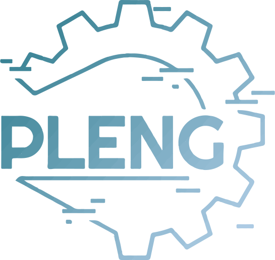

# PLENG, a solução para o gerenciamento de seus projetos

   

 
PLENG (sigla para Planejamento do Engenheiro) é um sistema desenvolvido principalmente em PHP que tem como principal objetivo facilitar o gerenciamento de projetos na área da engenharia civil, auxiliando na previsão de calculos e apresentando de uma forma mais simples o desempenho da obra, além dos dados relacionados a mesma para poder contribuir com seu andamento e esclarecer questões encontradas pelo seu responsável.

 

<b> Versão 1.0 - Liberada dia 18/04/2021 </b>
